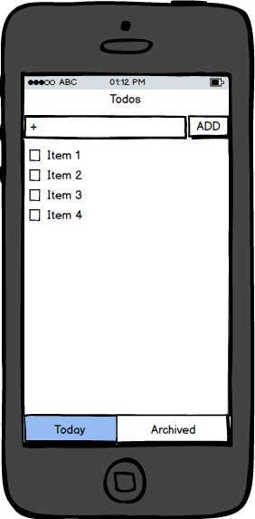
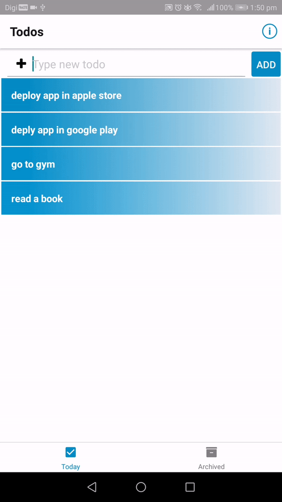
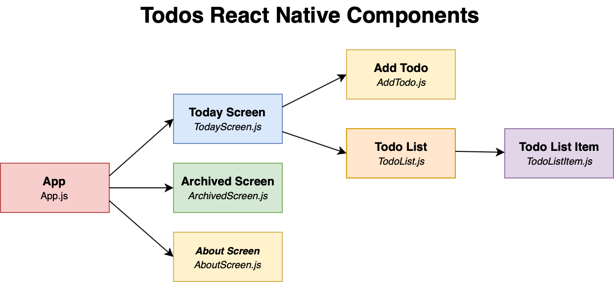

    
    
    
    

# Todos - Let It Finish
A dynamic private todo list app developed using react native. A simple todo list app to help you accomplish your tasks. No more cluttering with time-consuming features. Just add a todo task and click it again to archive.

You can easily see the archived list and can delete all.

    
    
     
    

# React Native Tutorial
I have started react native tutorial series on Youtube. If you want to learn React Native and related technologies subscribe my [youtube channel](https://www.youtube.com/channel/UCtHlgyUw0wLE5Ous9swfFlg) and follow [React Native Tutorial Playlist](https://www.youtube.com/watch?v=kFEs5WB7NB0&list=PLlMOodDAsO4zOGT-g9wsb2Xwk-3HgvNZD)

# Demo
- [Youtube Demo](https://www.youtube.com/watch?v=mfwVlMEkmpQ)
- [My Other Mobile Apps](https://ithinkdiff.net)

# Table of Contents

- [Technology Used](#technology-used)
- [Features](#features)
- [Setup in local machine](#setup-in-local-machine)
- [Publish in Google Play and Apple Store](#publish-in-Google-Play-and-apple-store)
- [Contribution](#contribution)
- [Questions or feedback?](#questions-or-feedback)

## Technology Used
1. [React Native](https://facebook.github.io/react-native/)
2. [Expo](https://expo.io/@mahmudahsan)
3. And some other 3rd party libraries mentioned in code

## Features
This is my first react native and expo based project. So I wanted to develop a simple todo list application with nothing fancy. 

But in future I may update it with more feature like authentication, cloud data synching features and more.

## Setup in local machine
1. In your machine, you have to install [Node.js](https://nodejs.org/en/), [Yarn](https://yarnpkg.com/en/)

2. On terminal run command `yarn install` it will check the app's package.json file and install all libraries

3. `yarn start` will start expo and you can run in simulator or your device

## Publish in Google Play and Apple Store
1. Change and modify the `config/Settings.js` 

2. Change and modify the `assets/icon.png` 

3. [Expo Build](https://docs.expo.io/versions/latest/distribution/building-standalone-apps/) has detailed description how to build and submit your app.

4. Android [App Signing](https://docs.expo.io/versions/v32.0.0/distribution/app-signing/)

5. Apple [app store submission](https://docs.expo.io/versions/v32.0.0/distribution/app-stores/)

## Contribution
If you want to contribute on this project, you're welcome to fork the project and submit a pull request. 

## Questions or feedback?

Feel free to open an issue, or find me [@mahmudahsan on Twitter](https://twitter.com/mahmudahsan).
